<picture>
  <source media="(prefers-color-scheme: light)" srcset="assets/header-light.svg">
  
</picture>

  
  
  
  

<a href="#about">About</a> · <a href="#experience">Experience</a> · <a href="#now">Sonder</a> · <a href="#projects">Projects</a> · <a href="#toolbox">Toolbox</a> · <a href="#off-keyboard">Off-keyboard</a> · <a href="#contributions">Contributions</a>

<picture>
  <source media="(prefers-color-scheme: light)" srcset="assets/about-light.svg">
  
</picture>

 

<picture>
  <source media="(prefers-color-scheme: light)" srcset="assets/experience-light.svg">
  
</picture>

 

<picture>
  <source media="(prefers-color-scheme: light)" srcset="assets/sonder-light.svg">
  
</picture>

> Sonder works out **which specific misunderstanding** sits behind a Grade 8 student's wrong answer in Maths, Physics or Chemistry. Then it gives that student a learning activity built for that exact misunderstanding, and checks later that the idea stuck.
>
> Every diagnosis comes from **transparent logic, not a black-box AI model**, and teachers approve everything before a student or parent sees it.
>
> Built with a team of three: the diagnostic engine, content for all three subjects, and the teacher and student app. We're now preparing for classroom pilots.

 

<picture>
  <source media="(prefers-color-scheme: light)" srcset="assets/projects-banner-light.svg">
  
</picture>

<table>
<tr>
<td width="50%" valign="top">
<a href="https://github.com/AhmedLaiq34/Axiom"><picture>
  <source media="(prefers-color-scheme: light)" srcset="assets/project-axiom-light.svg">
  
</picture></a>
 <a href="https://github.com/AhmedLaiq34/Axiom">Explore Axiom ↗</a> · <a href="https://github.com/AhmedLaiq34/axiom-backend">Backend ↗</a>
</td>
<td width="50%" valign="top">
<a href="https://github.com/AhmedLaiq34/Sniff"><picture>
  <source media="(prefers-color-scheme: light)" srcset="assets/project-sniff-light.svg">
  
</picture></a>
 <a href="https://github.com/AhmedLaiq34/Sniff">Explore Sniff ↗</a> · <a href="https://github.com/AhmedLaiq34/sniff-backend">Backend ↗</a>
</td>
</tr>
<tr>
<td width="50%" valign="top">
<a href="https://github.com/AhmedLaiq34/Flow"><picture>
  <source media="(prefers-color-scheme: light)" srcset="assets/project-flow-light.svg">
  
</picture></a>
 <a href="https://github.com/AhmedLaiq34/Flow">Explore Flow ↗</a> · <a href="https://github.com/AhmedLaiq34/php_endpoint_flow">API ↗</a>
</td>
<td width="50%" valign="top">
<a href="https://github.com/AhmedLaiq34/HostForge"><picture>
  <source media="(prefers-color-scheme: light)" srcset="assets/project-hostforge-light.svg">
  
</picture></a>
 <a href="https://github.com/AhmedLaiq34/HostForge">Explore HostForge ↗</a> · <a href="https://github.com/AhmedLaiq34/Terraform-CI-CD">Terraform CI/CD ↗</a>
</td>
</tr>
</table>

<a href="https://github.com/AhmedLaiq34?tab=repositories">More experiments & projects →</a>

<picture>
  <source media="(prefers-color-scheme: light)" srcset="assets/toolbox-light.svg">
  
</picture>

 

<picture>
  <source media="(prefers-color-scheme: light)" srcset="assets/offkeyboard-light.svg">
  
</picture>

<a href="https://www.instagram.com/worksandwonder/">See my design work on Instagram: @worksandwonder ↗</a>

<picture>
  <source media="(prefers-color-scheme: light)" srcset="assets/motion-banner-light.svg">
  
</picture>

<!-- This is an animation of contribution history, not a playable game. -->
<picture>
  <source media="(prefers-color-scheme: light)" srcset="assets/contributions-light.svg">
  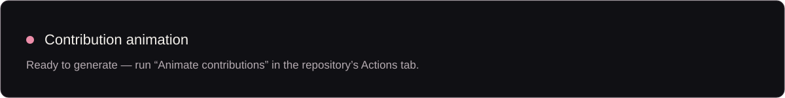
</picture>

Updated daily with GitHub Actions.

 

<picture>
  <source media="(prefers-color-scheme: light)" srcset="assets/contact-light.svg">
  
</picture>

<a href="mailto:ahmedlaiq2004@gmail.com">ahmedlaiq2004@gmail.com</a> · <a href="https://ahmedlaiq.me">ahmedlaiq.me</a> · <a href="https://www.linkedin.com/in/ahmed-laiq">LinkedIn</a> · <a href="https://www.instagram.com/worksandwonder/">@worksandwonder</a>

